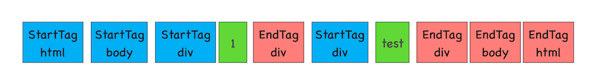

# DOM树构建

渲染引擎内部的 **HTML解析器** 负责将 HTML 字节流转换成 DOM 结构，渲染进程和网络进程建立管道后，网络进程加载了多少数据，HTML 解析器便解析多少数据。(HTML 解析器开始工作时，会默认创建了一个根为 document 的空 DOM 结构)

1. 通过分词器将字节流转换为 Token

    通过分词器先将字节流转换为一个个 Token，分为 Tag Token 和文本 Token。例如：

    

2. 将 Token 解析为 DOM 节点，并将 DOM 节点添加到 DOM 树中。

    HTML 解析器维护了一个 Token 栈结构，该 Token 栈主要用来计算节点之间的父子关系

   * 如果压入到栈中的是 StartTag Token，HTML 解析器会为该 Token 创建一个 DOM 节点，然后将该节点加入到 DOM 树中，它的父节点就是栈中相邻的那个元素生成的节点。
   * 如果分词器解析出来是文本 Token，那么会生成一个文本节点，然后将该节点加入到 DOM 树中，文本 Token 是不需要压入到栈中，它的父节点就是当前栈顶 Token 所对应的 DOM 节点。
   * 如果分词器解析出来的是 EndTag 标签，比如是 EndTag div，HTML 解析器会查看 Token 栈顶的元素是否是 StarTag div，如果是，就将 StartTag div 从栈中弹出，表示该 div 元素解析完成。

::: tip 注意
解析过程遇到 script 标签，会暂停整个 DOM 的解析，执行 JavaScript 代码，不过这里执行 JavaScript 时，需要先下载这段 JavaScript 代码。(JavaScript 文件的下载过程会阻塞 DOM 解析)

Chrome 通过**预解析**优化，当渲染引擎收到字节流之后，会开启一个预解析线程，用来分析 HTML 文件中包含的 JavaScript、CSS 等相关文件，解析到相关文件之后，预解析线程会提前下载这些文件。
:::
