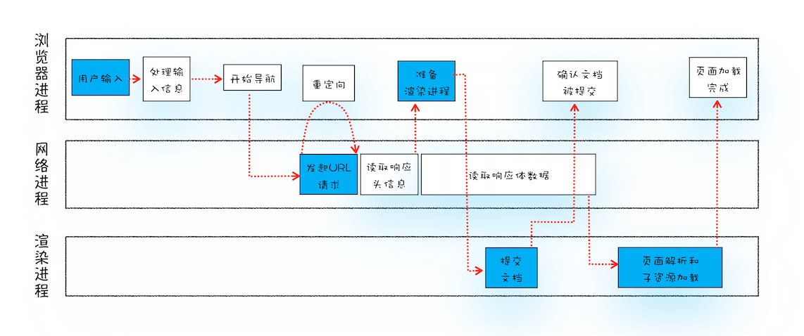

# 导航流程

用户发出 URL 请求到页面开始解析的这个过程，就叫做导航。

## 大致过程

* 首先，浏览器进程接收到用户输入的 URL 请求，浏览器进程便将该 URL 转发给网络进程。
* 然后，在网络进程中发起真正的 URL 请求。
* 接着网络进程接收到了响应头数据，便解析响应头数据，并将数据转发给浏览器进程。
* 浏览器进程接收到网络进程的响应头数据之后，发送“提交导航 (CommitNavigation)”消息到渲染进程；
* 渲染进程接收到“提交导航”的消息之后，便开始准备接收 HTML 数据，接收数据的方式是直接和网络进程建立数据管道；
* 最后渲染进程会向浏览器进程“确认提交”，这是告诉浏览器进程：“已经准备好接受和解析页面数据了”。
* 浏览器进程接收到渲染进程“确认提交”的消息之后，便开始移除之前旧的文档，然后更新浏览器进程中的页面状态。

具体过程：

## 1.用户输入

当用户在地址栏中输入一个查询关键字时，地址栏会判断输入的关键字是搜索内容，还是请求的 URL。

* 如果是搜索内容，地址栏会使用浏览器默认的搜索引擎，来合成新的带搜索关键字的 URL(如未提供协议或有效域名)
* 如果判断输入内容符合 URL 规则，那么地址栏会根据规则，把这段内容加上协议，合成为完整的 URL

当前页面执行 beforeunload

## 2.URL请求

浏览器进程通过 IPC 把 URL 请求发到网络进程，网络进程负责真正的 URL 请求。

首先查找本地缓存，如果有设置强缓存，直接返回资源给浏览器进程。

如果没有设置缓存或者缓存过期，开始发起网络请求。首先发起 DNS 解析，获取 IP 地址，如果请求协议是 HTTPS，那么还需要建立 TLS 连接。接下来就是利用 IP 地址和服务器建立 TCP 连接。连接建立之后，浏览器端会构建请求行、请求头等信息，并把和该域名相关的 Cookie 等数据附加到请求头中，然后向服务器发送构建的请求信息。([具体查看HTTP请求流程](./HTTP请求流程))

服务器接收到请求信息后，会根据请求信息生成响应数据（包括响应行、响应头和响应体等信息），并发给网络进程。等网络进程接收了响应行和响应头之后，就开始解析响应头的内容了。

 1. **重定向**

    在接收到服务器返回的响应头后，网络进程开始解析响应头，如果发现返回的状态码是 301 或者 302，那么说明服务器需要浏览器重定向到其他 URL。这时网络进程会从响应头的 Location 字段里面读取重定向的地址，然后再发起新的 HTTP 或者 HTTPS 请求，一切又重头开始了。

 2. **响应数据类型处理**

    Content-Type 是 HTTP 头中一个非常重要的字段， 它告诉浏览器服务器返回的响应体数据是什么类型。如果 Content-Type 字段的值被浏览器判断为下载类型，那么该请求会被提交给浏览器的下载管理器，同时该 URL 请求的导航流程就此结束。但如果是 HTML，那么浏览器则会继续进行导航流程。

## 3.准备渲染进程

默认情况下，Chrome 会为每个页面分配一个渲染进程(同一站点特殊处理)

## 4.提交导航

* 首先当浏览器进程接收到网络进程的响应头数据之后，便向渲染进程发起“提交导航”的消息
* 渲染进程接收到“提交导航”的消息后，会和网络进程建立传输数据的“管道”
* 等文档数据传输完成之后，渲染进程会返回“确认提交”的消息给浏览器进程；
* 浏览器进程在收到“确认提交”的消息后，会更新浏览器界面状态，包括了安全状态、地址栏的 URL、前进后退的历史状态，并更新 Web 页面（此时的web页面是空白页）。
* 渲染进程对文档进行页面解析和子资源加载

## 参考资料

* [导航流程：从输入URL到页面展示，这中间发生了什么？](https://time.geekbang.org/column/article/117637)
* [深入了解现代Web浏览器（第2部分）](https://developers.google.com/web/updates/2018/09/inside-browser-part2#top_of_page)
