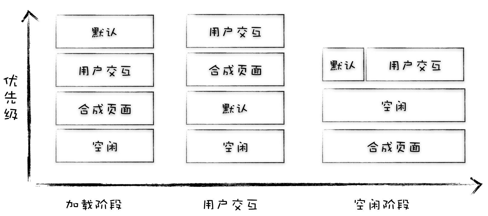
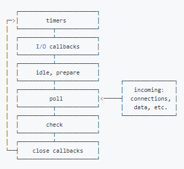

# 消息队列&事件循环

每个渲染进程都有一个主线程，既要处理 DOM，又要计算样式，还要处理布局，同时还需要处理 JavaScript 任务以及各种输入事件。为了协调事件，用户交互，脚本，渲染，网络任务等，浏览器用到了消息队列和事件循环系统

其中渲染进程专门有一个 IO 线程用来接收其他进程传进来的消息，接收到消息之后，会将这些消息组装成任务发送给渲染主线程

消息队列中的任务类型包括了输入事件（鼠标滚动、点击、移动）、微任务、文件读写、WebSocket、JavaScript 定时器等等，除此之外，消息队列中还包含了很多与页面相关的事件，如 JavaScript 执行、解析 DOM、样式计算、布局计算、CSS 动画等。

::: tip 注意
**事件循环中可能会有一个或多个任务队列，浏览器会在保持任务顺序的前提下，可能分配四分之三的优先权给鼠标和键盘事件，保证用户的输入得到最高优先级的响应，这就用到了动态调度策略**
:::

## 动态调度

* **页面加载阶段**，在这个阶段，用户的最高诉求是在尽可能短的时间内看到页面，至于交互和合成并不是这个阶段的核心诉求，因此我们需要调整策略，在加载阶段将页面解析，JavaScript 脚本执行等任务调整为优先级最高的队列，降低交互合成这些队列的优先级。
* **交互阶段**，当在执行用户交互的任务时，将合成任务的优先级调整到最高
* **防止任务饿死**，在某个状态下，一直有新的高优先级的任务加入到队列中，这样就会导致其他低优先级的任务得不到执行，这称为任务饿死。Chromium 为了解决任务饿死的问题，给每个队列设置了执行权重，也就是如果连续执行了一定个数的高优先级的任务，那么中间会执行一次低优先级的任务，这样就缓解了任务饿死的情况。

<!-- 事件循环是有调度算法的。每次执行任务会从任务队列中取一个优先级较高的出队执行(用户交互的任务优先级较高，以便更流畅的响应界面交互) -->
## setTimeout实现

当通过 JavaScript 创建一个定时器时，渲染进程会将该定时器的回调任务添加到延迟队列(**其实是一个 hashmap 结构**)中。处理完消息队列中的一个任务后，开始执行 **ProcessDelayTask** 函数，ProcessDelayTask 函数会根据发起时间和延迟时间计算出到期的任务，然后依次执行这些到期的任务。等到期的任务执行完成之后，再继续下一个循环过程。

注意事项：

* **如果当前任务执行时间过久，会影响定时器任务的执行**
* **如果 setTimeout 存在嵌套调用，那么系统会设置最短时间间隔为 4 毫秒**
* **未激活的页面，setTimeout 执行最小间隔是 1000 毫秒**
* **延时执行时间有最大值，如果超过了 2147483647 ms，那么相当于延时值被设置为 0 了**

## 微任务队列

当 JavaScript 执行一段脚本的时候，V8 会为其创建一个全局执行上下文，在创建全局执行上下文的同时，V8 引擎也会在内部创建一个微任务队列，例如 MutationObserver 和 Promise 回调会加在微任务队列中

* 微任务和宏任务是绑定的，每个宏任务在执行时，会创建自己的微任务队列。
* 微任务的执行时长会影响到当前宏任务的时长。
* 在一个宏任务中，分别创建一个用于回调的宏任务和微任务，无论什么情况下，微任务都早于宏任务执行。
* 如果在执行微任务的过程中，产生了新的微任务，同样会将该微任务添加到微任务队列中，V8 引擎一直循环执行微任务队列中的任务，直到队列为空才算执行结束。

## requestAnimationFrame

是一个特别的异步任务，不加入普通消息队列，回调是在下次渲染之前执行。常用来做动画

* 果任务本身又新增 Animation callback 就不会当场执行了，因为那是下一个循环
* 回调也会产生阻塞

## 对比 Node 下的 Event Loop

Node下的事件循环分为6个阶段，每当进入某一个阶段的时候，都会从对应的回调队列中取出函数去执行。当队列为空或者执行的回调函数数量到达系统设定的阈值，就会进入下一阶段。

* **timers 阶段**：这个阶段执行timer（setTimeout、setInterval）的回调
* **I/O callbacks 阶段**：处理一些上一轮循环中的少数未执行的 I/O 回调
* **idle, prepare 阶段**：仅node内部使用
* **poll 阶段**：获取新的I/O事件, 适当的条件下node将阻塞在这里
* **check 阶段**：执行 setImmediate() 的回调
* **close callbacks 阶段**：执行 socket 的 close 事件回调

外部输入数据-->轮询阶段(poll)-->检查阶段(check)-->关闭事件回调阶段(close callback)-->定时器检测阶段(timer)-->I/O事件回调阶段(I/O callbacks)-->闲置阶段(idle, prepare)-->轮询阶段（按照该顺序反复运行）

### timers 阶段

timers 阶段会执行 setTimeout 和 setInterval 回调，并且是由 poll 阶段控制的。 同样，在 Node 中定时器指定的时间也不是准确时间，只能是尽快执行。

### poll 阶段

主要作用：

1. 进入该阶段时设定了 timer 的话，判断poll 队列是否为空，如果是空的并且 timer 超时，回到 timer 阶段执行回调。
2. 如果没有设定了 timer 的话，
   1. 如果 poll 队列不为空，会遍历回调队列并同步执行，直到队列为空或者达到系统限制
   2. 如果 poll 队列为空时，如果有 setImmediate 回调需要执行，poll 阶段会停止并且进入到 check 阶段执行回调，如果没有 setImmediate 回调需要执行，会等待回调被加入到队列中并立即执行回调，这里同样会有个超时时间设置防止一直等待下去

### check 阶段

setImmediate()的回调会被加入check队列中

:::tip 宏任务和微任务区分

* 常见的 宏任务有setTimeout、setInterval、 setImmediate、script（整体代码）、 I/O 操作等。
* new Promise().then(回调)等。
* process.nextTick 是独立于 Event Loop 之外的，它有一个自己的队列，当每个阶段完成后，如果存在 nextTick 队列，就会清空队列中的所有回调函数，并且优先于其他 microtask 执行。
:::

### 与浏览器 Event Loop 区别

浏览器环境下，microtask的任务队列是每个macrotask执行完之后执行。而在Node.js(**node11 之前**)中，microtask会在事件循环的各个阶段之间执行，也就是一个阶段执行完毕，就会去执行microtask队列的任务。Node 11 之后行为与浏览器 Event Loop 保持一致。

## 参考资料

* [浏览器工作原理与实践](https://time.geekbang.org/column/article/132931)
* [【掘金】深入解析你不知道的 EventLoop 和浏览器渲染、帧动画、空闲回调](https://juejin.im/post/6844904165462769678)
