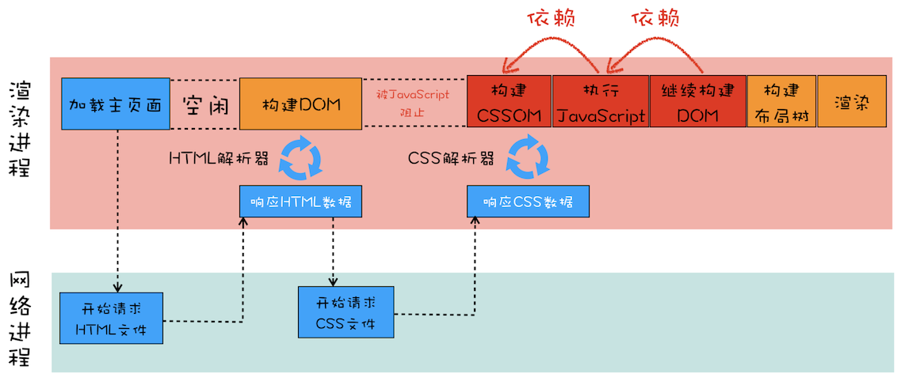

# 渲染流程

按照渲染的时间顺序，流水线可分为如下几个子阶段：构建 DOM 树、样式计算、布局阶段、分层、绘制、分块、光栅化和合成。一个完整的渲染流程大致可总结为：

1. **渲染进程将 HTML 内容转换为能够读懂的 DOM 树结构**
2. **渲染引擎将 CSS 样式表转化为浏览器可以理解的 styleSheets，计算出 DOM 节点的样式**
3. **创建布局树，并计算元素的布局信息**
4. **对布局树进行分层，并生成分层树**
5. **为每个图层生成绘制列表，并将其提交到合成线程**
6. **合成线程将图层分成图块，并在光栅化线程池中将图块转换成位图**
7. **合成线程发送绘制图块命令 DrawQuad 给浏览器进程**
8. **浏览器进程根据 DrawQuad 消息生成页面，并显示到显示器上**

DOM树构建

## 构建DOM树

当浏览器接收到服务器响应来的HTML文档后，会遍历文档节点，生成DOM树。

需要注意的是，DOM树的生成过程中可能会被CSS和JS的加载执行阻塞

[构建DOM树详情](./DOM树构建.md)

## 样式计算(生成CSSOM)

1. **把 CSS 转换为浏览器能够理解的结构** 
当渲染引擎接收到 CSS 文本时，会执行一个转换操作，将 CSS 文本转换为浏览器可以理解的结构——styleSheets。
2. **转换样式表中的属性值，使其标准化** 
如 2em、blue、bold，这些类型数值不容易被渲染引擎理解，所以需要将所有值转换为渲染引擎容易理解的、标准化的计算值，这个过程就是属性值标准化。
3. **计算出 DOM 树中每个节点的具体样式** 
根据CSS 的继承规则和层叠规则计算每个节点的样式

## 布局阶段

1. **创建布局树** 
根据 DOM 和 CSSOM 创建布局树，遍历 DOM 树中的所有可见节点，并把这些节点加到布局树中(如dispaly:none)
2. **布局计算** 
计算每个节点的具体位置

## 分层

因为页面中有很多复杂的效果，如一些复杂的 3D 变换、页面滚动，或者使用 z-indexing 做 z 轴排序等，为了更加方便地实现这些效果，渲染引擎还需要为特定的节点生成专用的图层，并生成一棵对应的**图层树**（LayerTree）。Chrome 的“开发者工具”，选择“Layers”标签

通常情况下，并不是布局树的每个节点都包含一个图层，如果一个节点没有对应的层，那么这个节点就从属于父节点的图层。

拥有层叠上下文属性的元素会被提升为单独的一层。（例如明确定位属性的元素、定义透明属性的元素、使用 CSS 滤镜的元素等，都拥有层叠上下文属性。）([层叠上下文参考](https://developer.mozilla.org/zh-CN/docs/Web/Guide/CSS/Understanding_z_index/The_stacking_context))。动条也会被提升为单独的层

## 图层绘制

渲染引擎会把一个图层的绘制拆分成很多小的绘制指令，然后再把这些指令按照顺序组成一个待绘制列表

## 栅格化（raster）

实际上绘制操作是由渲染引擎中的合成线程来完成的，渲染主线程和合成线程之间的关系：

当图层的绘制列表准备好之后，主线程会把该绘制列表提交（commit）给合成线程， 
合成线程会将图层划分为图块（tile），这些图块的大小通常是 256x256 或者 512x512 
合成线程会按照视口附近的图块来优先生成位图，实际生成位图的操作是由栅格化来执行的。所谓栅格化，是指将图块转换为位图

通常，栅格化过程都会使用 GPU 来加速生成，使用 GPU 生成位图的过程叫快速栅格化，或者 GPU 栅格化

## 合成和显示

一旦所有图块都被光栅化，合成线程就会生成一个绘制图块的命令——“DrawQuad”，然后将该命令提交给浏览器进程。 
浏览器进程里面有一个叫 viz 的组件，用来接收合成线程发过来的 DrawQuad 命令，然后根据 DrawQuad 命令，将其页面内容绘制到内存中，最后再将内存显示在屏幕上。

### 缓冲区、帧、频率

显示器有固定刷新频率，通常是60HZ，即每秒更新60张图片，这些图片来自于显卡的**前缓冲区**。

显卡的职责是合成新图像，并保存在**后缓冲区**，之后前缓冲区和后缓冲区互换，保证显示器能取到最新的图像。

大多数设备屏幕的更新频率是 60 次 / 秒，这也就意味着正常情况下要实现流畅的动画效果，渲染引擎需要每秒更新 60 张图片到显卡的后缓冲区。

渲染流水线生成的每一副图片称为一帧，每秒更新了多少帧称为帧率，比如滚动过程中 1 秒更新了 60 帧，那么帧率就是 60Hz（或者 60FPS）。

::: tip 注意
合成操作是在合成线程上完成的，这也就意味着在执行合成操作时，是不会影响到主线程执行的
:::

## 渲染阻塞问题

* head 标签中的外部链接 css 会阻塞页面布局渲染，先加载 CSS 文件([查看](#样式计算-生成cssom))
* JS 文件会阻塞后面 DOM 树构建

## 优化

[参考阅读](./页面优化.md)

## 相关阅读

[重排和重绘](./重排和重绘)

## 参考资料

* [渲染流程（上）：HTML、CSS和JavaScript，是如何变成页面的？](https://time.geekbang.org/column/article/118205)
* [渲染流程（下）：HTML、CSS和JavaScript，是如何变成页面的？](https://time.geekbang.org/column/article/118826)
* [【干货】十分钟读懂浏览器渲染流程](https://juejin.im/post/5a8e242c5188257a6b060000)
