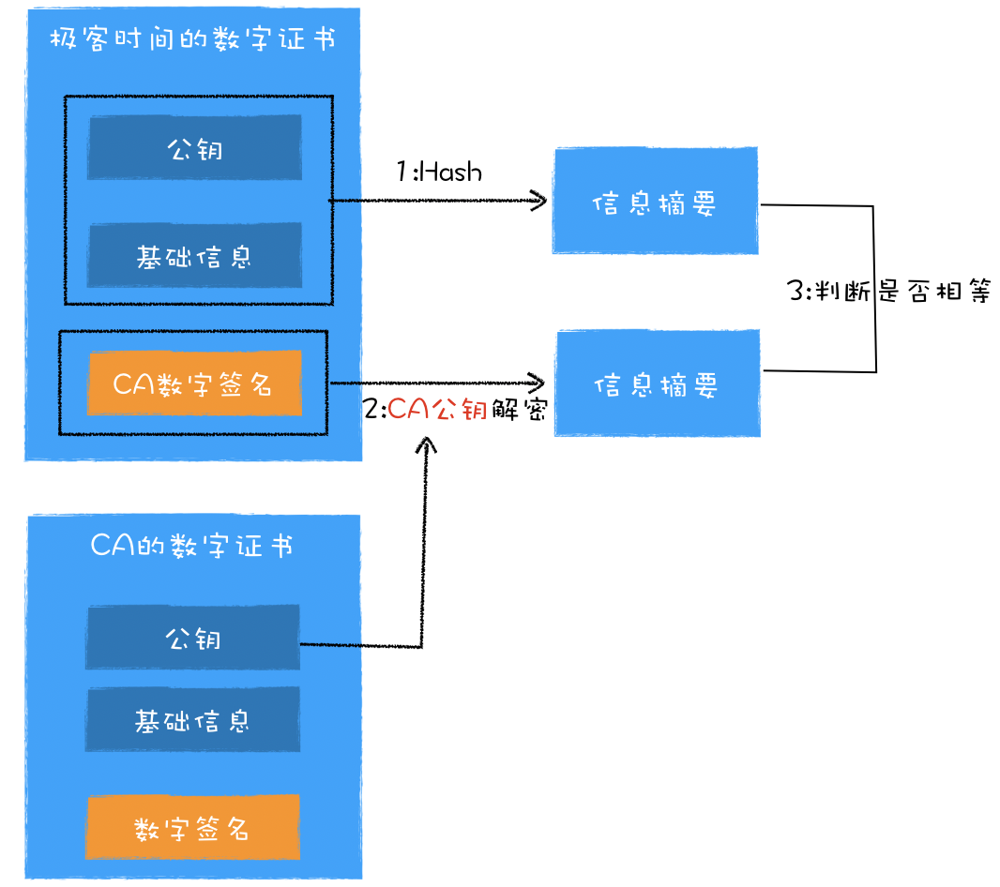

# HTTPS

HTTP 是明文传输的，导致内容很容易被中间人窃取、伪造和篡改。

HTTPS 相当于在 TCP 和 HTTP 加入了安全层，对发起 HTTP 请求的数据进行加密操作和对接收到 HTTP 的内容进行解密操作。

## 对称加密

对称加密是指加密和解密都使用的是相同的密钥。缺点：容易被破解

## 非对称加密

非对称加密算法有 A、B 两把密钥，如果你用 A 密钥来加密，那么只能使用 B 密钥来解密；反过来，如果你要 B 密钥来加密，那么只能用 A 密钥来解密。

在 HTTPS 中，服务器会将其中的一个密钥通过明文的形式发送给浏览器，我们把这个密钥称为公钥，服务器自己留下的那个密钥称为私钥。顾名思义，公钥是每个人都能获取到的，而私钥只有服务器才能知道，不对任何人公开。

缺点：效率低

## 对称加密+非对称加密

在传输数据阶段依然使用对称加密，但是对称加密的密钥我们采用非对称加密来传输。

## 数字证书

在**对称加密+非对称加密**方法中，在使用非对称密钥的时候，公钥可能被拦截篡改，所以需要服务器向浏览器提供证明

CA 颁发的数字证书(CA 使用 HASH 函数计算明文信息，并用自己的私钥加密，加密后的密文就是数字签名)有两个作用：一个是通过数字证书向浏览器证明服务器的身份，另一个是数字证书里面包含了服务器公钥。

这里服务器没有直接返回公钥给浏览器，而是返回了数字证书，而公钥正是包含在数字证书中的；在浏览器端多了一个证书验证的操作，验证了证书之后，才继续后续流程。

### 浏览器验证数字证书

1. 证书的有限期，证书里面含有证书的有效期，所以浏览器只需要判断当前时间是否在证书的有效期范围内即可。
2. 证数字证书是否被吊销了。
   1. 下载吊销证书列表 - CRL
   2. 在线验证方式 - OCSP
3. 验证数字证书是否是 CA 机构颁发的。
   1. 浏览器利用证书的原始信息计算出信息摘要
   2. 利用 CA 的公钥来解密数字证书中的数字签名，解密出来的数据也是信息摘要；
   3. 判断这两个信息摘要是否相等就可以了。

### 浏览器获取 CA 公钥

当部署 HTTPS 服务器的时候，除了部署当前的数字证书之外，还需要部署 CA 机构的数字证书，CA 机构的数字证书包括了 CA 的公钥，以及 CA 机构的一些基础信息。然后在建立 HTTPS 链接时，服务器会将这两个证书一同发送给浏览器，于是浏览器就可以获取到 CA 的公钥了。如果有些服务器没有部署 CA 的数字证书，那么浏览器还可以通过网络去下载 CA 证书

### 数字证书链

将 CA 分为 **根 CA** 和 **中间 CA**，通常申请者都是向中间 CA 去申请证书的，而根 CA 作用就是给中间 CA 做认证。每个根 CA 机构都维护了一个树状结构，一个根 CA 下面包含多个中间 CA，而中间 CA 又可以包含多个中间 CA。这样就形成了一个证书链，你可以沿着证书链从用户证书追溯到根证书。

如何验证根证书的合法性，它只是简单地判断这个根证书在不在操作系统里面，如果在，那么浏览器就认为这个根证书是合法的，如果不在，那么就是非法的。

:::tip 申请根 CA
如果某个机构想要成为根 CA，并让它的根证书内置到操作系统中，那么这个机构首先要通过 WebTrust 国际安全审计认证。
:::

## 总结

由于 HTTP 的明文传输特性，在传输过程中的每一个环节，数据都有可能被窃取或者篡改，这倒逼着我们需要引入加密机制。于是我们在 HTTP 协议栈的 TCP 和 HTTP 层之间插入了一个安全层，负责数据的加密和解密操作。

我们使用对称加密实现了安全层，但是由于对称加密的密钥需要明文传输，所以我们又将对称加密改造成了非对称加密。但是非对称加密效率低且不能加密服务器到浏览器端的数据，于是我们又继续改在安全层，采用对称加密的方式加密传输数据和非对称加密的方式来传输密钥，这样我们就解决传输效率和两端数据安全传输的问题。

采用这种方式虽然能保证数据的安全传输，但是依然没办法证明服务器是可靠的，于是又引入了数字证书，数字证书是由 CA 签名过的，所以浏览器能够验证该证书的可靠性。

## 参考资料

* [HTTPS：让数据传输更安全](https://time.geekbang.org/column/article/156181)
* [谈谈 HTTPS](https://juejin.im/post/6844903504046211079)
