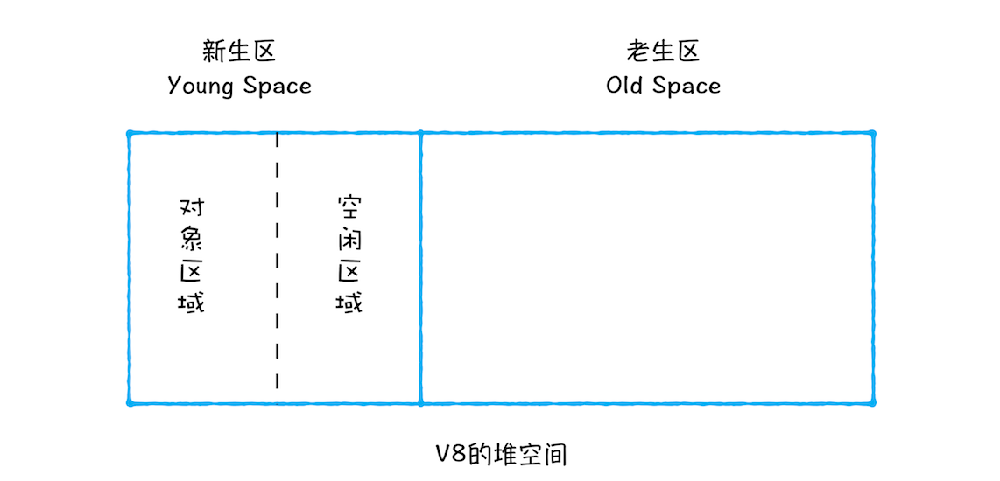

# 垃圾回收

通常情况下，垃圾数据回收分为手动回收和自动回收两种策略。Javascript 语言产生的垃圾数据是由垃圾回收器来释放的。

## 调用栈的垃圾回收

```javascript
function foo(){
    var a = 1
    var b = {name:"极客邦"}
    function showName(){
      var c = 2
      var d = {name:"极客时间"}
    }
    showName()
}
foo()
```

其中，原始类型的数据被分配到栈中，引用类型的数据会被分配到堆中。当 foo 函数执行结束之后，foo 函数的执行上下文会从堆中被销毁掉。当执行到 showName 函数时，JavaScript 引擎会创建 showName 函数的执行上下文，并将 showName 函数的执行上下文压入到调用栈中。与此同时，**还有一个记录当前执行状态的指针（称为 ESP）**，指向调用栈中 showName 函数的执行上下文，表示当前正在执行 showName 函数。

接着，当 showName 函数执行完成之后，函数执行流程就进入了 foo 函数，那这时就需要销毁 showName 函数的执行上下文了。ESP 这时候就帮上忙了，JavaScript 会将 ESP 下移到 foo 函数的执行上下文，这个下移操作就是销毁 showName 函数执行上下文的过程。


## 堆内存的垃圾回收

### 代际假说

代际假说有以下两个特点：

1. 第一个是大部分对象在内存中存在的时间很短，简单来说，就是很多对象一经分配内存，很快就变得不可访问
2. 第二个是不死的对象，会活得更久。

在 V8 中会把堆分为新生代和老生代两个区域，新生代中存放的是生存时间短的对象，老生代中存放的生存时间久的对象。新生区通常只支持 1～8M 的容量，而老生区支持的容量就大很多了。对于这两块区域，V8 分别使用两个不同的垃圾回收器，以便更高效地实施垃圾回收。

* **副垃圾回收器，主要负责新生代的垃圾回收**
* **主垃圾回收器，主要负责老生代的垃圾回收**

### 副垃圾回收器

副垃圾回收器主要负责新生区的垃圾回收。而通常情况下，大多数小的对象都会被分配到新生区，所以说这个区域虽然不大，但是垃圾回收还是比较频繁的。

新生代中用 **Scavenge** 算法来处理。所谓 **Scavenge** 算法，是把新生代空间对半划分为两个区域，一半是对象区域，一半是空闲区域。如图：



新加入的对象都会存放到对象区域，当对象区域快被写满时，就需要执行一次垃圾清理操作。

在垃圾回收过程中，**首先要对对象区域中的垃圾做标记**；标记完成之后，就进入垃圾清理阶段，副垃圾回收器会**把这些存活的对象复制到空闲区域**中，同时它还会把这些对象有序地排列起来，所以这个复制过程，也就相当于完成了内存整理操作，**复制后空闲区域就没有内存碎片了**。

完成复制后，**对象区域与空闲区域进行角色翻转**，也就是原来的对象区域变成空闲区域，原来的空闲区域变成了对象区域。这样就完成了垃圾对象的回收操作，同时这种角色翻转的操作还能让新生代中的这两块区域无限重复使用下去。

由于新生代中采用的 Scavenge 算法，所以每次执行清理操作时，都需要将存活的对象从对象区域复制到空闲区域。但复制操作需要时间成本，如果新生区空间设置得太大了，那么每次清理的时间就会过久，所以为了执行效率，一般新生区的空间会被设置得比较小。

也正是因为新生区的空间不大，所以很容易被存活的对象装满整个区域。为了解决这个问题，JavaScript 引擎采用了对象晋升策略，也就是**经过两次垃圾回收依然还存活的对象，会被移动到老生区中**。

### 主垃圾回收器

主垃圾回收器主要负责老生区中的垃圾回收。除了新生区中晋升的对象，一些大的对象会直接被分配到老生区。因此老生区中的对象有两个特点，一个是对象占用空间大，另一个是对象存活时间长。

由于老生区的对象比较大，若要在老生区中使用 Scavenge 算法进行垃圾回收，复制这些大的对象将会花费比较多的时间，从而导致回收执行效率不高，同时还会浪费一半的空间。因而，主垃圾回收器是采用**标记-清除**(Mark-Sweep)的算法进行垃圾回收的。

首先是标记过程阶段。标记阶段就是从一组根元素开始，递归遍历这组根元素，在这个遍历过程中，能到达的元素称为活动对象，没有到达的元素就可以判断为垃圾数据。


如上图，当 showName 函数执行结束之后，ESP 向下移动，指向了 foo 函数的执行上下文，这时候如果遍历调用栈，是不会找到引用 1003 地址的变量，也就意味着 1003 这块数据为垃圾数据，被标记为红色。由于 1050 这块数据被变量 b 引用了，所以这块数据会被标记为活动对象。这就是大致的标记过程。


上面的标记过程和清除过程就是**标记-清除**算法，不过对一块内存多次执行标记-清除算法后，会产生大量不连续的内存碎片。而碎片过多会导致大对象无法分配到足够的连续内存，于是又产生了另外一种算法——**标记-整理**（Mark-Compact）


标记过程仍然与标记-清除算法里的是一样的，后续步骤是让所有存活的对象都向一端移动，然后直接清理掉端边界以外的内存。

### 全停顿(Stop-The-World)

由于 JavaScript 是运行在主线程之上的，一旦执行垃圾回收算法，都需要将正在执行的 JavaScript 脚本暂停下来，待垃圾回收完毕后再恢复脚本执行。我们把这种行为叫做全停顿。

如果在执行垃圾回收的过程中，占用主线程时间过久，花费了 200 毫秒，在这 200 毫秒内，主线程是不能做其他事情的。比如页面正在执行一个 JavaScript 动画，因为垃圾回收器在工作，就会导致这个动画在这 200 毫秒内无法执行的，这将会造成页面的卡顿现象。


为了降低老生代的垃圾回收而造成的卡顿，V8 将标记过程分为一个个的子标记过程，同时让垃圾回收标记和 JavaScript 应用逻辑交替进行，直到标记阶段完成，我们把这个算法称为**增量标记**（Incremental Marking）算法


使用增量标记算法，可以把一个完整的垃圾回收任务拆分为很多小的任务，这些小的任务执行时间比较短，可以穿插在其他的 JavaScript 任务中间执行，这样当执行上述动画效果时，就不会让用户因为垃圾回收任务而感受到页面的卡顿了。

## 参考资料

* [垃圾回收：垃圾数据是如何自动回收的？](https://time.geekbang.org/column/article/131233)
